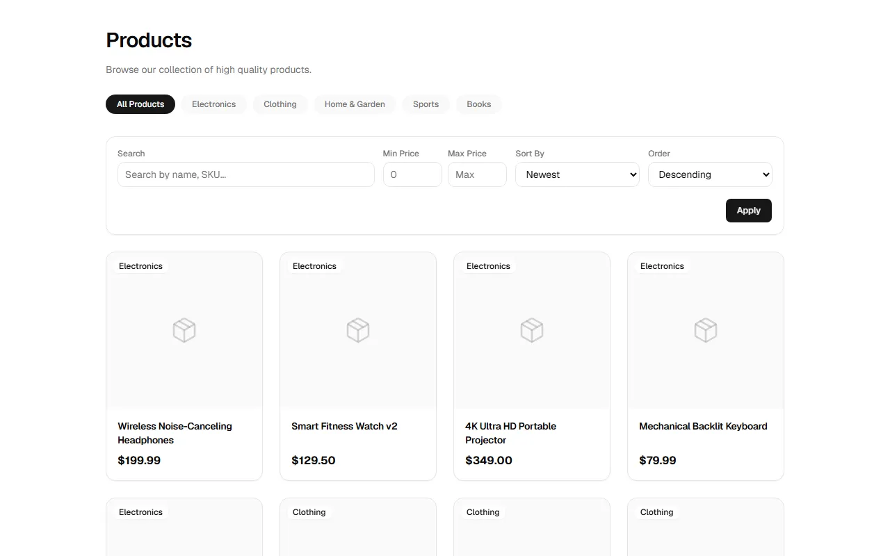
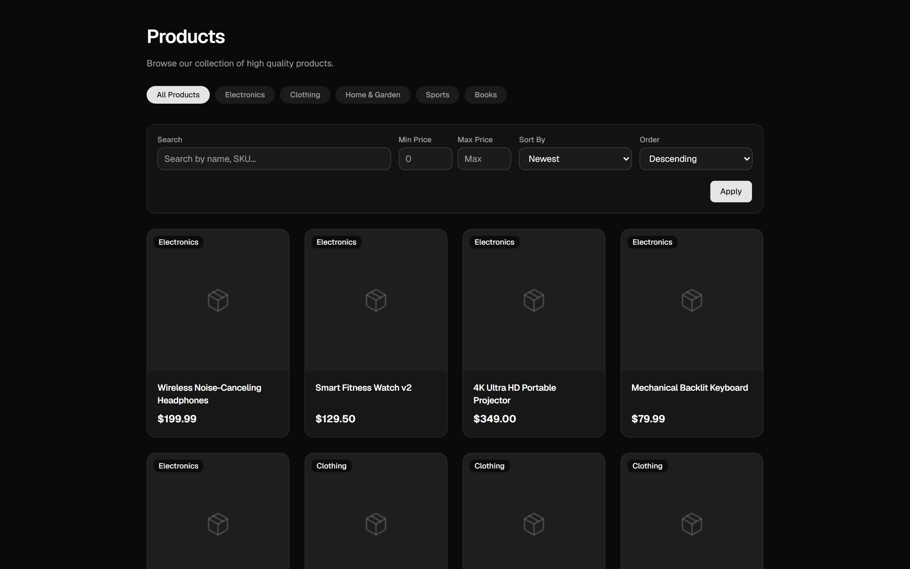
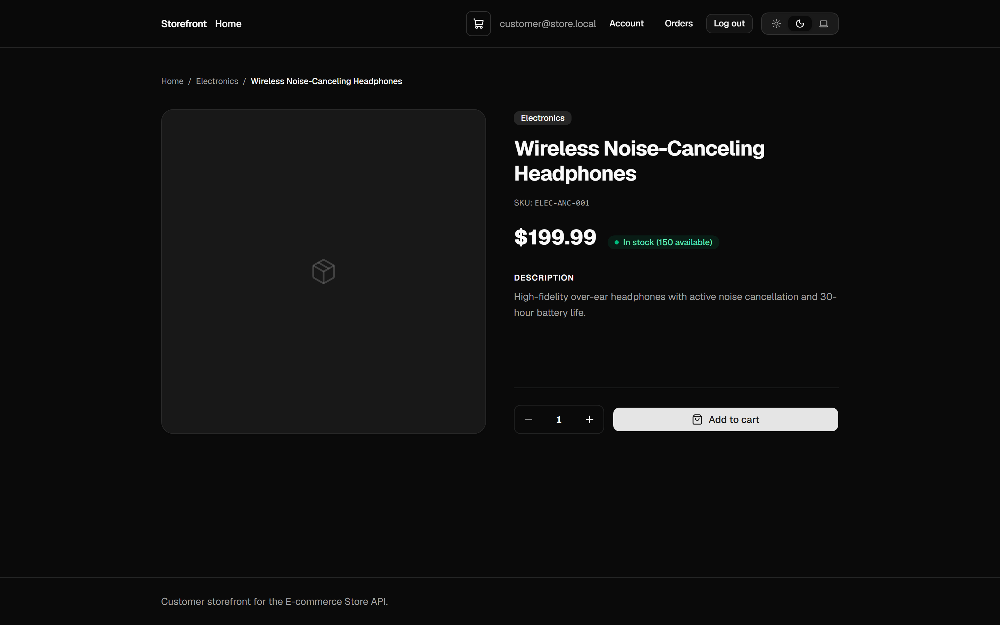
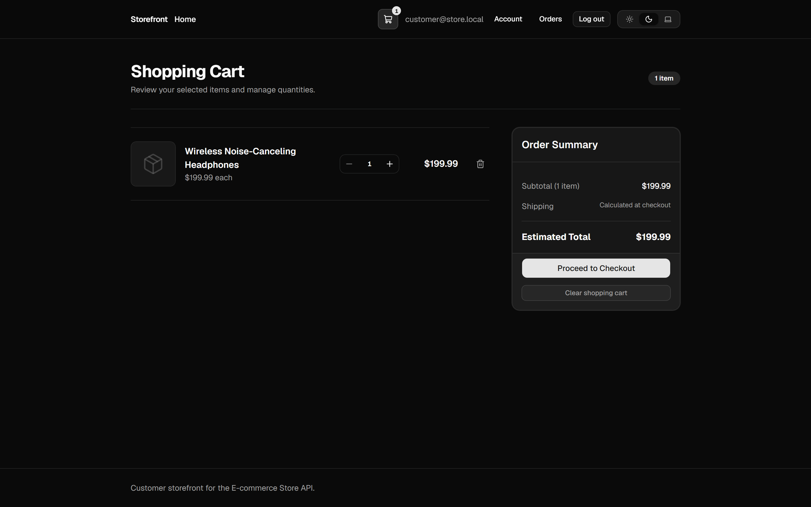
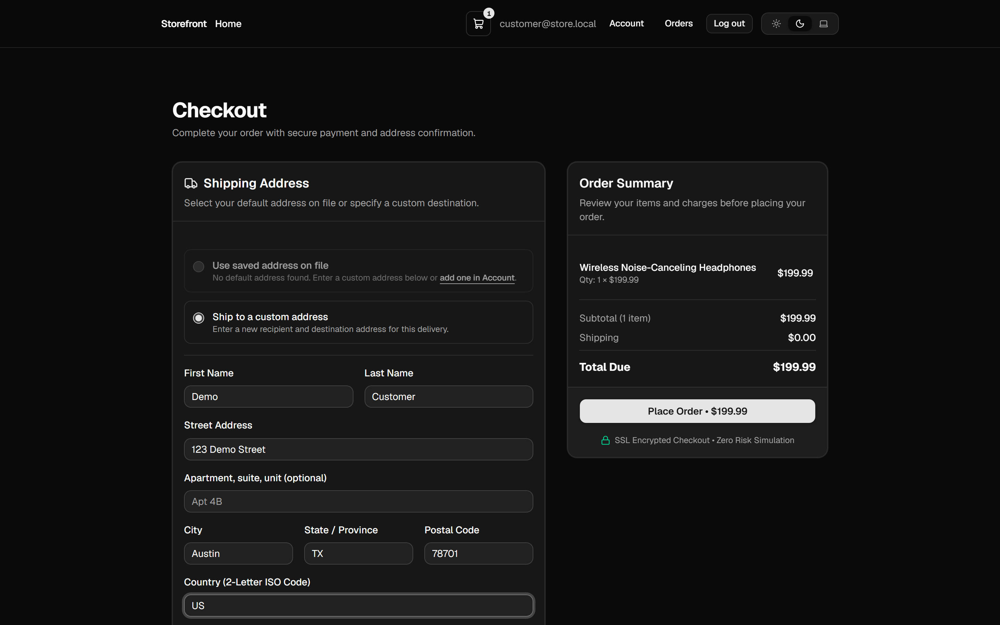
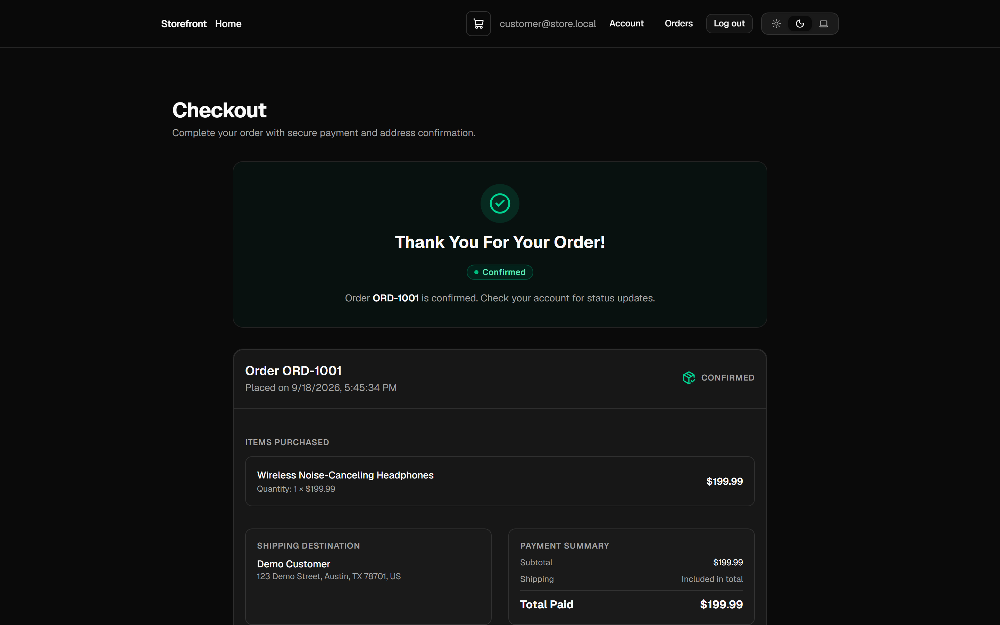

# E-commerce Store Web

<p align="center">
  <a href="https://github.com/raouf-b-dev/ecommerce-store-web/actions"></a>
  <a href="https://www.typescriptlang.org/"></a>
  <a href="https://react.dev/"></a>
  <a href="https://nextjs.org/"></a>
  <a href="https://tailwindcss.com/"></a>
  <a href="https://tanstack.com/query"></a>
  <a href="LICENSE"></a>
</p>

> Customer storefront for the [E-commerce Store API](https://github.com/raouf-b-dev/ecommerce-store-api). Next.js 16 App Router. Business rules stay in the API.

<p align="center">
  
</p>

## Table of Contents

- [What this is](#what-this-is)
- [Quick start](#quick-start)
- [Architecture](#architecture)
- [Screenshots](#screenshots)
- [Tech stack](#tech-stack)
- [Documentation](#documentation)
- [Related repositories](#related-repositories)
- [Project layout](#project-layout)
- [Contributing](#contributing)
- [License](#license)

---

<a id="what-this-is"></a>

## What this is

Next.js App Router storefront for the NestJS ecommerce API. Catalog, cart, checkout, orders, and customer account management are wired against the live OpenAPI contract. Remaining work is tracked in [`docs/ROADMAP.md`](docs/ROADMAP.md).

This app handles UI, routing, and client caching only. Pricing, stock, checkout orchestration, auth, and permissions stay in the API.

**Current limits**

| Topic            | Status                                                                 |
| :--------------- | :--------------------------------------------------------------------- |
| Application code | Port **3100**. Catalog, cart, checkout, orders, and account are live (mock payments). Further hardening is tracked in [`docs/ROADMAP.md`](docs/ROADMAP.md). |
| Payments         | Mock adapter behind a swappable hexagonal port (no live card UI / Stripe Elements). |
| Hosted demo      | None.                                                                  |

---

<a id="quick-start"></a>

## Quick start

Requires Node.js 24+ and npm 11+ (see `.nvmrc`).

1. `npm ci`
2. `npm run env:init` (copies `.env.example` to `.env.local`; create `.secrets` for later Playwright)
3. Start the API from the [API README](https://github.com/raouf-b-dev/ecommerce-store-api) on port **3000**. CORS must allow `http://localhost:3100` with credentials.
4. `npm run dev` - storefront at [http://localhost:3100](http://localhost:3100)

### Without the API

`npm run dev:mock` starts MSW handlers for shopper paths (catalog, cart, checkout). Playwright still needs a live API.

`npm run dev` and `npm run start` both bind **3100**. Stop one before starting the other.

Regenerate OpenAPI types (API must be running): `npm run api:generate`.

Client rules: [`docs/API-INTEGRATION.md`](docs/API-INTEGRATION.md). Security baseline: [`SECURITY.md`](SECURITY.md).

---

<a id="architecture"></a>

## Architecture

```text
Browser -> Next.js (RSC + client components) -> versioned HTTP API -> ecommerce-store-api
```

| Rule        | Detail                                                                             |
| :---------- | :--------------------------------------------------------------------------------- |
| Boundary    | Do not reimplement stock, pricing, or RBAC here. Show API errors clearly.          |
| Data access | Typed client from the API OpenAPI/Swagger spec. No BFF.                            |
| Rendering   | Server Components by default. Catalog RSC is unauthenticated on purpose.           |
| Client data | TanStack Query for session, cart, checkout, and orders.                            |
| Auth        | In-memory access token + HttpOnly refresh cookie on the API origin.                |
| Cart        | Authenticated only (`manage_own_cart`). No guest basket.                           |
| Checkout    | Idempotency headers as OpenAPI documents; poll own order for SAGA completion.      |

---

<a id="screenshots"></a>

## Screenshots

Captured from `npm run dev:mock` (MSW). Mock payments; no hosted demo.

<p align="center">
  <picture>
    <source media="(prefers-color-scheme: dark)" srcset="docs/assets/screenshot-catalog-dark.png">
    <source media="(prefers-color-scheme: light)" srcset="docs/assets/screenshot-catalog-light.png">
    
  </picture>
</p>

<p align="center">
  <picture>
    <source media="(prefers-color-scheme: dark)" srcset="docs/assets/screenshot-product-detail-dark.png">
    <source media="(prefers-color-scheme: light)" srcset="docs/assets/screenshot-product-detail-light.png">
    
  </picture>
</p>

<p align="center">
  <picture>
    <source media="(prefers-color-scheme: dark)" srcset="docs/assets/screenshot-cart-dark.png">
    <source media="(prefers-color-scheme: light)" srcset="docs/assets/screenshot-cart-light.png">
    
  </picture>
</p>

<p align="center">
  <picture>
    <source media="(prefers-color-scheme: dark)" srcset="docs/assets/screenshot-checkout-dark.png">
    <source media="(prefers-color-scheme: light)" srcset="docs/assets/screenshot-checkout-light.png">
    
  </picture>
</p>

<p align="center">
  <picture>
    <source media="(prefers-color-scheme: dark)" srcset="docs/assets/screenshot-order-confirmation-dark.png">
    <source media="(prefers-color-scheme: light)" srcset="docs/assets/screenshot-order-confirmation-light.png">
    
  </picture>
</p>

Regenerate: [`docs/assets/README.md`](docs/assets/README.md).

---

<a id="tech-stack"></a>

## Tech stack

| Layer          | Choice                                                              |
| :------------- | :------------------------------------------------------------------ |
| Framework      | Next.js 16 App Router (`cacheComponents`, Turbopack)                |
| UI             | React 19                                                            |
| Language       | TypeScript (strict)                                                 |
| Styling        | Tailwind CSS v4 + shadcn/ui (Radix)                                 |
| Public reads   | React Server Components (unauthenticated catalog)                   |
| Client data    | TanStack Query (session, cart, checkout, orders)                    |
| Local UI state | React state (no global store for server data)                       |
| Forms          | React Hook Form + Zod                                               |
| API            | `openapi-fetch` + generated OpenAPI types                           |
| Tests          | Vitest, Testing Library, Playwright                                 |

---

<a id="documentation"></a>

## Documentation

| Document                                             | Description                                                                                       |
| :--------------------------------------------------- | :------------------------------------------------------------------------------------------------ |
| [`CONTRIBUTING.md`](CONTRIBUTING.md)                 | Fork workflow, CLA, setup, PR expectations                                                        |
| [`LICENSING.md`](LICENSING.md)                       | Dual license: AGPL-3.0-only, and a commercial license from the author                             |
| [`CLA.md`](CLA.md)                                   | Contributor License Agreement                                                                     |
| [`CODE_OF_CONDUCT.md`](CODE_OF_CONDUCT.md)           | Community standards                                                                               |
| [`SECURITY.md`](SECURITY.md)                         | Frontend security baseline                                                                        |
| [`docs/ROADMAP.md`](docs/ROADMAP.md)                 | Delivery plan, Next.js 16 conventions, ship gates                                                 |
| [`docs/API-INTEGRATION.md`](docs/API-INTEGRATION.md) | Client integration rules (OpenAPI is the contract)                                                |
| [`docs/README.md`](docs/README.md)                   | Docs index                                                                                        |
| [`docs/ai/README.md`](docs/ai/README.md)             | Agent and conventions docs                                                                        |
| [`docs/architecture/ARCHITECTURE.md`](docs/architecture/ARCHITECTURE.md) | System context                                                                                    |
| [`AGENT.md`](AGENT.md)                               | Canonical agent policy                                                                            |
| API docs                                             | [`ecommerce-store-api/docs`](https://github.com/raouf-b-dev/ecommerce-store-api/tree/master/docs) |

---

<a id="related-repositories"></a>

## Related repositories

| Repository                                                                              | Role        |
| :-------------------------------------------------------------------------------------- | :---------- |
| [`ecommerce-store-api`](https://github.com/raouf-b-dev/ecommerce-store-api)             | Backend API |
| [`ecommerce-admin-dashboard`](https://github.com/raouf-b-dev/ecommerce-admin-dashboard) | Admin SPA   |

Each repository runs independently. Clone companions from the table when you need a full local stack.

---

<a id="project-layout"></a>

## Project layout

```
src/
  app/                    # thin routes, layouts, metadata; (shop)/(auth)/(account)
  components/
    layout/               # header, footer, skip link, mobile nav
    theme/                # light/dark/system
    feedback/             # QueryStateAlert, QueryLoading, ActionErrorAlert
    ui/                   # shadcn primitives + StatusBadge
  features/
    auth/                 # login, register, change-password
    catalog/              # RSC list/detail, SEO
    cart/                 # authenticated cart
    checkout/             # idempotent checkout + order polling
    health/               # /status diagnostics
  lib/
    api/generated/        # OpenAPI schema.d.ts
    api/browser-client.ts # session + mutations
    api/server-client.ts  # RSC OpenAPI client
    format.ts
    list-filters.ts
    utils.ts
docs/
  API-INTEGRATION.md
  ROADMAP.md
  ai/                     # agent conventions
  architecture/           # ADRs
```

---

<a id="contributing"></a>

## Contributing

See [`CONTRIBUTING.md`](CONTRIBUTING.md). Please follow the [`CODE_OF_CONDUCT.md`](CODE_OF_CONDUCT.md).

---

<a id="license"></a>

## License

[AGPL-3.0-only](LICENSE). See [LICENSING.md](LICENSING.md).

Everyone may use this project under the GNU Affero General Public License v3.0 only (AGPL-3.0). Commercial licenses are available from the author. Contact: https://github.com/raouf-b-dev

Releases up to and including [v0.2.0](https://github.com/raouf-b-dev/ecommerce-store-web/releases/tag/v0.2.0) remain under MIT.

---

Built by [Abderaouf .B](https://github.com/raouf-b-dev) | [Issues](https://github.com/raouf-b-dev/ecommerce-store-web/issues) | [Repository](https://github.com/raouf-b-dev/ecommerce-store-web)
