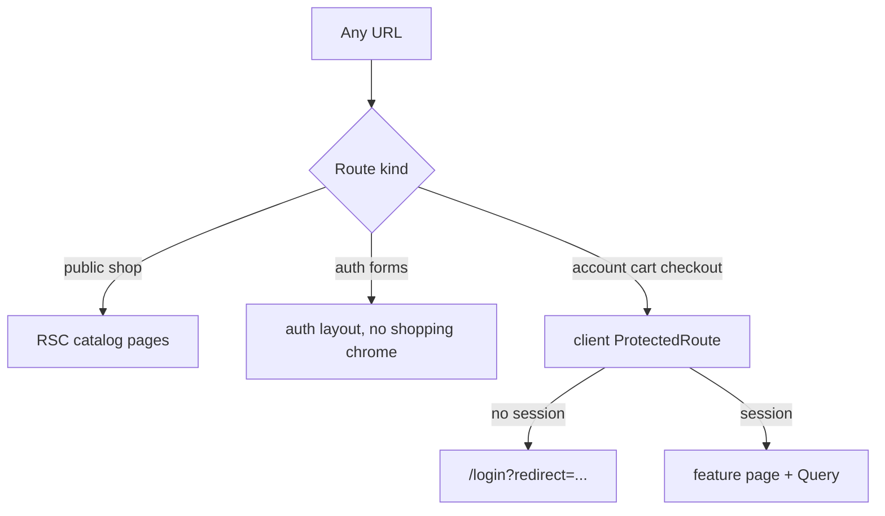
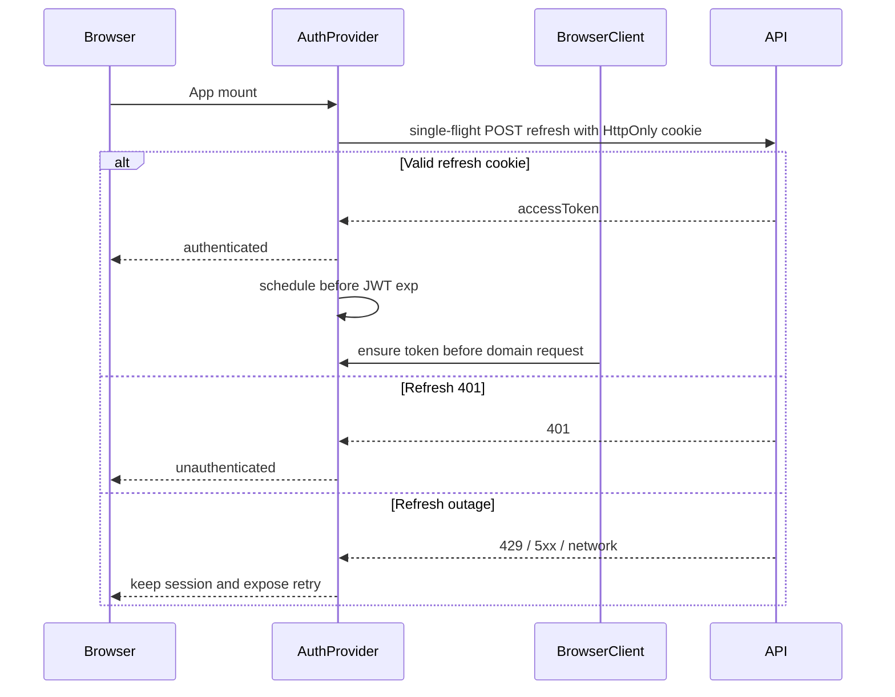

# Storefront Architecture

High-level architecture for the customer-facing Next.js App Router storefront.

## System context

```text
Browser -> Next.js (RSC + client components) -> versioned HTTP API -> ecommerce-store-api
```

Backend context: [ecommerce-store-api ARCHITECTURE.md](https://github.com/raouf-b-dev/ecommerce-store-api/blob/master/docs/architecture/ARCHITECTURE.md).

| Rule           | Detail                                                                  |
| :------------- | :---------------------------------------------------------------------- |
| Boundary       | Pricing, stock, checkout, auth, and permissions live in the API.        |
| Data access    | Typed client from OpenAPI (`openapi-fetch` + generated schema). No BFF. |
| Public catalog | Unauthenticated RSC. Do not attach a Bearer token.                      |
| Client data    | TanStack Query for session, cart, and checkout (orders not wired yet).  |
| Auth           | In-memory access token + HttpOnly refresh cookie on the API origin.     |
| Cart           | Authenticated only (`manage_own_cart`). No guest line-item basket.      |
| Checkout       | Idempotency as OpenAPI documents; poll own order for SAGA completion.   |

## App composition (current)

```text
src/app/layout.tsx
  html (FOUC script, suppressHydrationWarning)
    Providers (Theme + QueryClient + Auth + ThemeAwareToaster)
  Suspense > FocusMainOnNavigate
    (shop)/layout.tsx   # skip + header/footer + main#main
      (shop)/page.tsx   # home / catalog
      (shop)/products/[id]/page.tsx
      (shop)/cart/      # ProtectedRoute
      (shop)/checkout/  # ProtectedRoute + order polling
      (shop)/status/page.tsx
    (auth)/layout.tsx   # GuestRoute + minimal auth chrome
      login/page.tsx
      register/page.tsx
      change-password/page.tsx
    (account)/layout.tsx  # StorefrontChrome + ProtectedRoute
      account/page.tsx
```

The browser session is global so shopper chrome can reflect login state. Catalog
RSC fetchers remain separate and token-free.

The storefront scrolls the document naturally. Avoid viewport-locked `h-screen overflow-hidden` layouts.

## Routing model

Rationale: [ADR-0001](adr/ADR-0001-rsc-catalog-browser-session-no-bff.md).



- Public catalog is RSC and does not require a session.
- Cart, checkout, and account are client-gated because the access token is in memory.
- Missing catalog resources use App Router `notFound()` before streaming ([ADR-0008](adr/ADR-0008-resource-404-via-app-router.md)).

## Auth and session

Rationale: [ADR-0002](adr/ADR-0002-in-memory-access-token-with-httponly-refresh-cookie.md), [ADR-0003](adr/ADR-0003-single-flight-silent-refresh.md), [ADR-0007](adr/ADR-0007-keep-session-alive-for-refresh-token-lifetime.md).



Next `cookies()` cannot read the API-origin refresh cookie. The session Query
runs only in the browser. Bootstrap, proactive refresh, and one-shot domain-401
recovery share raw `fetch` and one in-flight promise; a same-origin Web Lock
serializes refresh and logout across tabs. Access tokens stay in memory and are
never copied to browser storage.

## Directory tree (as of this writing)

```text
src/
  app/
    layout.tsx
    providers.tsx
    error.tsx
    not-found.tsx
    global-error.tsx
    globals.css
    robots.ts
    sitemap.ts
    opengraph-image.tsx
    twitter-image.tsx
    (shop)/
      layout.tsx
      page.tsx
      error.tsx
      status/page.tsx
      products/[id]/
        page.tsx
        not-found.tsx
      cart/
        layout.tsx
        page.tsx
      checkout/
        layout.tsx
        page.tsx
    (auth)/
      layout.tsx
      login/page.tsx
      register/page.tsx
      change-password/page.tsx
    (account)/
      layout.tsx
      account/page.tsx
  components/
    layout/       # chrome, skip, mobile nav, focus helper
    theme/        # provider, store, toggle, toaster
    feedback/     # QueryStateAlert, QueryLoading, ActionErrorAlert
    seo/          # JsonLd primitive
    ui/           # shadcn primitives + StatusBadge
  features/
    auth/         # typed API operations, forms, schemas, redirect safety
    catalog/      # RSC list/detail, filters, feature SEO
    cart/         # authenticated cart Query + mutations
    checkout/     # idempotent checkout, order polling, confirmation
    health/       # /status diagnostics
  lib/
    format.ts
    list-filters.ts
    storefront-origin.ts
    utils.ts
    seo/          # config, metadata factory, canonical, json-ld serialize
    api/
      browser-client.ts
      silent-refresh.ts
      form-api-errors.ts
      throw-api-error.ts
      server-client.ts
      parse-api-error.ts
      generated/
        schema.d.ts
    auth/         # provider, guards, in-memory token, refresh policy
  test/
    setup.ts
    fixtures/
e2e/
  auth.spec.ts
  session.spec.ts
  catalog.spec.ts
  cart.spec.ts
  checkout.spec.ts
  smoke.spec.ts
  shell.spec.ts
scripts/
  generate-api-client.js
  generate-env.js
```

## Related ADRs

See [adr/README.md](adr/README.md).
