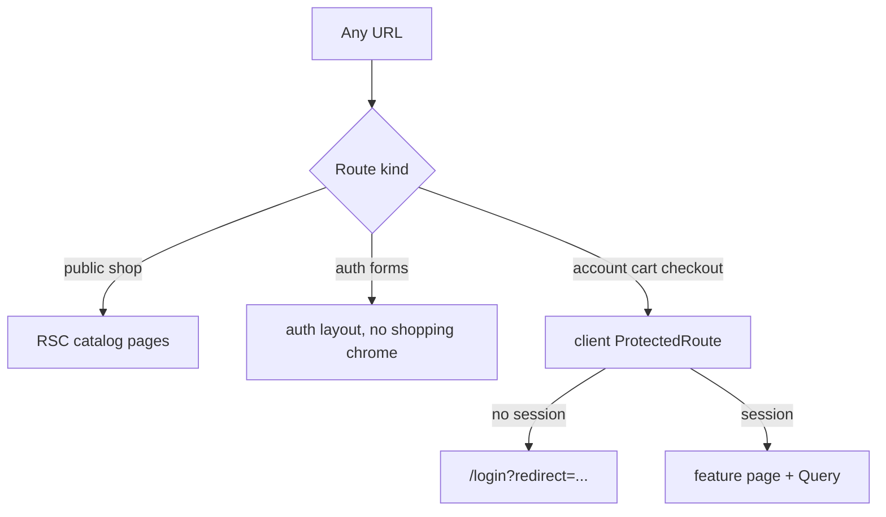
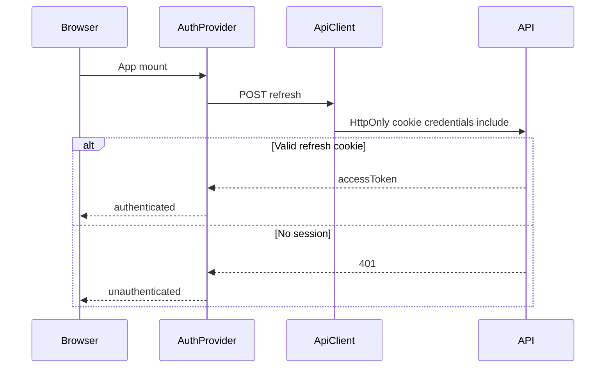

# Storefront Architecture

High-level architecture for the customer-facing Next.js App Router storefront.

## System context

```text
Browser -> Next.js (RSC + client components) -> versioned HTTP API -> ecommerce-store-api
                                                                    ^
Admin SPA / mobile apps --------------------------------------------+
```

Backend context: [ecommerce-store-api ARCHITECTURE.md](https://github.com/raouf-b-dev/ecommerce-store-api/blob/master/docs/architecture/ARCHITECTURE.md).

| Rule | Detail |
| :--- | :----- |
| Boundary | Pricing, stock, checkout, auth, and permissions live in the API. |
| Data access | Typed client from OpenAPI (`openapi-fetch` + generated schema). No BFF. |
| Public catalog | Unauthenticated RSC. Do not attach a Bearer token. |
| Client data | TanStack Query for session, cart, checkout, and orders (when wired). |
| Auth | In-memory access token + HttpOnly refresh cookie on the API origin. |
| Cart | Authenticated only (`manage_own_cart`). No guest line-item basket. |
| Checkout | Idempotency as OpenAPI documents; poll own order for SAGA completion. |

## App composition (current)

```text
src/app/layout.tsx
  html (FOUC script, suppressHydrationWarning)
  Providers (Theme + ThemeAwareToaster)
  Suspense > FocusMainOnNavigate
    (shop)/layout.tsx   # skip + header/footer + main#main
      (shop)/page.tsx   # home
      (shop)/status/page.tsx
    (auth)/layout.tsx   # skip + logo/theme + main (no pages yet)
    (account)/layout.tsx  # same shop chrome, no guards (no pages yet)
```

Theme is mounted. QueryClient and AuthProvider are not; they belong with session work.

The storefront scrolls the document. Do not use an `h-screen overflow-hidden` operator cockpit.

## Routing model (target)

Rationale: [ADR-0001](adr/ADR-0001-rsc-catalog-browser-session-no-bff.md).



- Public catalog is RSC and does not require a session.
- Cart, checkout, and account are client-gated because the access token is in memory.
- Do not put session checks in `proxy.ts`.

## Auth and session (target)

Rationale: [ADR-0002](adr/ADR-0002-in-memory-access-token-with-httponly-refresh-cookie.md), [ADR-0003](adr/ADR-0003-single-flight-silent-refresh.md).



Next `cookies()` cannot read the API refresh cookie. Silent refresh uses raw `fetch`, not the OpenAPI middleware.

## Directory tree (as of this writing)

```text
src/
  app/
    layout.tsx
    providers.tsx
    loading.tsx
    error.tsx
    not-found.tsx
    global-error.tsx
    globals.css
    (shop)/
      layout.tsx
      page.tsx
      loading.tsx
      error.tsx
      status/page.tsx
    (auth)/layout.tsx
    (account)/layout.tsx
  components/
    layout/       # chrome, skip, mobile nav, focus helper
    theme/        # provider, store, toggle, toaster
    feedback/     # QueryStateAlert, ActionErrorAlert
    ui/           # shadcn primitives
  features/
    health/       # /status diagnostics
  lib/
    format.ts
    list-filters.ts
    utils.ts
    api/
      server-client.ts
      parse-api-error.ts
      generated/
        schema.d.ts
  test/
    setup.ts
e2e/
  smoke.spec.ts
  shell.spec.ts
scripts/
  generate-api-client.js
  generate-env.js
```

## Related ADRs

See [adr/README.md](adr/README.md).
